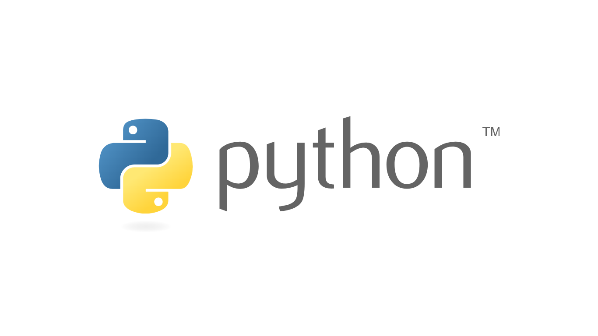

# Manejo de Archivos con Python

Esta es una aplicación para identificar archivos en carpetas, clasificarlos, crear carpetas en base a su extensión y mover los mismos hacia sus nuevas carpetas de destino.

---

## Cómo funciona el programa?

---

* **Para iniciar el programa, correr el comando:**
  * ```python main.py``` (Windows)
  * ```python3 main.py``` (Mac OS, Linux)

**Esto puede hacerse desde la terminal (Indicando la ruta a la carpeta) ó directamente desde tu editor de código.**

---

Al iniciar el programa, se desplegará un menú de opciones, en las cuales se ejecutará diferente acciones dependiendo de cual se elija, se recomienda ir en orden ascendente, comenzando por el paso 1.

  * **La primera opción (opción: 1)**
    * Lista todos los archivos que se encuentran dentro de     la carpeta indicada.
  * **La tercera opción (opción: 2)**
    * Crea las carpetas de destinos para cada tipo de archivo y su extensión.
  * **La cuarta opción (opción: 3)**
    * Mueve los archivos hacia las carpetas credadas en el paso anterior, identificando su extensión.
  * **La quinta y última opción (opción: 4)**
    * Termina el programa. 

___

* **Requerimientos para poder hacer uso de este programa:**
  * Tener instalado Python 3.9.6 o superior.

---

[Documentación - Manejo de Archivos con Python](https://drive.google.com/file/d/1asMUefK-ZY_jqYIAWFanAKGiiiHs4X5G/view?usp=share_link)